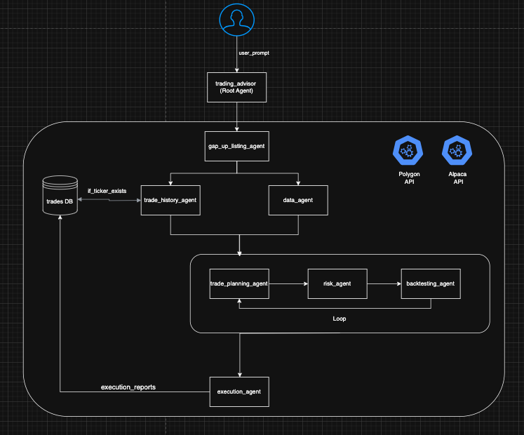

# Stock AI Agent - Multi-Agent Trading System

A sophisticated multi-agent AI system for small-cap gap-up stock trading that combines autonomous decision-making, data analysis, risk management, and automated execution.

## 🎯 Overview

This project implements an agentic AI system where multiple specialized agents work autonomously and collaboratively to identify, analyze, and execute high-probability gap-up opportunities in small-cap stocks with precision and risk management.

## 🏗️ Architecture

The system uses a coordinated network of **autonomous AI agents**, each with specialized capabilities and decision-making authority:

### Core Agents

1. **Gap-Up Listing Agent** - Autonomously identifies small-cap stocks with significant gap-up movements
2. **Data Agent** - Independently gathers comprehensive historical data (premarket, regular hours, after-hours)
3. **Trade Planning Agent** - Makes autonomous decisions on trading strategies based on historical patterns
4. **Risk Assessment Agent** - Provides independent risk analysis and dynamic position sizing
5. **Backtesting Agent** - Conducts autonomous strategy validation through rigorous historical simulation
6. **Execution Agent** - Makes real-time execution decisions through Interactive Brokers with precision
7. **Trades History Agent** - Queries database for historical trade data and provides performance insights



## 🚀 Key Features

- **Autonomous Decision-Making** - Each agent operates independently with specialized expertise
- **Collaborative Intelligence** - Agents communicate and share insights for optimal outcomes
- **Adaptive Learning** - Agents continuously improve their decision-making based on market feedback
- **Real-time gap-up detection** with customizable thresholds
- **Comprehensive data collection** including VWAP, volume analysis, and technical indicators
- **Pattern recognition** (Runner vs Fader classification)
- **Dynamic risk management** with position sizing optimization
- **Professional-grade backtesting** with Monte Carlo simulations
- **Automated execution** with strict risk controls

## 🛠️ Technology Stack

- **Google ADK (Agent Development Kit)** - Multi-agent orchestration and autonomous decision-making
- **Interactive Brokers API** - Trade execution
- **Python** - Core development language
- **Advanced backtesting framework** - Statistical validation
- **Real-time data feeds** - Market analysis
- **Agent-to-agent communication protocols** - Coordination and data sharing

## 📁 Project Structure

```
trading-advisor/
├── agents/
│   ├── agent.py
│   ├── backtesting_agent.py
│   ├── data_agent.py
│   ├── execution_agent.py
│   ├── gap_up_listing_agent.py
│   ├── risk_agent.py
│   ├── trade_planning_agent.py
│   ├── trades_history_agent.py
│   └── prompts/
│       ├── prompt_backtesting_agent.py
│       ├── prompt_data_agent.py
│       ├── prompt_execution_agent.py
│       ├── prompt_gap_up_listing_agent.py
│       ├── prompt_risk_agent.py
│       ├── prompt_trade_planning_agent.py
│       ├── prompt_trades_history_agent.py
│       └── prompt_trading_advisor.py
├── api_helper/
│   ├── alpaca_api_helper.py
│   ├── polygon_api_helper.py
├── config/
├── db/
│   ├── ticker_details_db.py
│   ├── init_trades_db.py
│   ├── trades_db.py
│   └── ticker_details.db
├── eval/
├── main.py
├── README.md
├── tests/
│   └── test_agents.py.txt
└── trading_advisor/
    └── sub_agents/
        └── trade_planning_agent/
```

## 🚀 Getting Started

### Prerequisites

- Python 3.8+
- Interactive Brokers account (for live trading)
- Google ADK access
- Required Python packages (see installation section)

### Installation

1. **Clone the repository**
   ```bash
   git clone https://github.com/yourusername/stock-ai-agent.git
   cd stock-ai-agent
   ```

2. **Install dependencies**
   ```bash
   pip install google-adk
   pip install ibapi  # Interactive Brokers API
   pip install pandas numpy matplotlib seaborn
   pip install yfinance alpha_vantage  # Data sources
   pip install absl-py  # For absl.flags and absl.app
   pip install python-dotenv  # For .env file support
   pip install google-cloud-aiplatform  # For Vertex AI
   ```

3. **Set up Google Cloud authentication**
   - Install the [Google Cloud SDK](https://cloud.google.com/sdk/docs/install) if you haven't already.
   - Authenticate your local environment:
     ```bash
     gcloud auth application-default login
     ```
   - (Optional) Set your project and region:
     ```bash
     gcloud config set project YOUR_PROJECT_ID
     gcloud config set ai/region YOUR_REGION
     ```

4. **Set up environment variables**
   ```bash
   cp .env.example .env
   # Edit .env with your API keys and broker credentials
   ```

5. **Configure Interactive Brokers**
   - Set up TWS or IB Gateway
   - Configure API connections
   - Set appropriate permissions

## 📊 Agent Descriptions

### Gap-Up Detection Agent
Identifies small-cap stocks with significant gap-up movements using customizable thresholds and market analysis.

### Data Agent
Gathers comprehensive historical data including:
- Previous day close, premarket open/high/volume
- Regular market open, day high/low, close
- VWAP, volume analysis, technical indicators
- Runner/Fader classification

### Trade Planning Agent
Develops detailed trading strategies based on:
- Historical pattern analysis
- Risk assessment integration
- Market condition adaptation
- Entry/exit optimization

### Risk Assessment Agent
Provides dynamic risk analysis including:
- Volatility assessment
- Position sizing recommendations
- Stop-loss optimization
- Risk-reward calculations

### Backtesting Agent
Conducts comprehensive strategy validation:
- Historical performance simulation
- Risk metrics calculation
- Statistical validation
- Strategy optimization recommendations

### Execution Agent
Handles trade execution with:
- Real-time order management
- Risk control enforcement
- Execution quality monitoring
- Performance tracking

### Trades History Agent
Analyzes historical trade data:
- Database queries for past executions
- Performance pattern recognition
- Strategy optimization insights
- Risk management improvements

## 🔧 Configuration

### Agent Configuration
Each agent can be configured through their respective prompt files in the `sub_agents/` directory.

### Risk Parameters
- Maximum position size per trade
- Stop-loss percentages
- Risk-reward ratios
- Portfolio heat limits

### Data Sources
- Polygon API (API Key Required)
- Alpaca API (real-time data/API Key Required)
- Interactive Brokers (real-time data)

## 📈 Usage Examples

### Running the Complete System
```python
from trading_advisor.agent import root_agent

# Initialize the multi-agent system
cd trading_advisor
adk web (for ADK web UI)
        or 
from root directory 
adk run . (for ADK cli input)


### Individual Agent Usage
```python
from trading_advisor.sub_agents.data_agent.data_agent import DataAgent
from trading_advisor.sub_agents.risk_agent.risk_agent import RiskAgent

# Use individual agents
data_agent = DataAgent()
risk_agent = RiskAgent()

# Get data and risk assessment
historical_data = data_agent.get_data(ticker_list)
risk_assessment = risk_agent.assess_risk(ticker_list)
```

## 🧪 Testing

Run the test suite:
```bash
python -m pytest tests/
```

Test individual agents:
```bash
python tests/test_agents.py
```

## 📊 Performance Metrics

The system tracks comprehensive performance metrics including:
- Win rate and profit factor
- Sharpe ratio and maximum drawdown
- Risk-adjusted returns
- Execution quality metrics
- Strategy effectiveness

## 🔒 Risk Management

- **Position Sizing**: Dynamic based on volatility and account size
- **Stop-Losses**: Multiple levels with trailing stops
- **Portfolio Limits**: Maximum exposure and correlation controls
- **Real-time Monitoring**: Continuous risk assessment
- **Emergency Procedures**: Automatic shutdown on risk breaches

## 🤝 Contributing

1. Fork the repository
2. Create a feature branch (`git checkout -b feature/amazing-feature`)
3. Commit your changes (`git commit -m 'Add amazing feature'`)
4. Push to the branch (`git push origin feature/amazing-feature`)
5. Open a Pull Request

## 📝 License

This project is licensed under the MIT License - see the [LICENSE](LICENSE) file for details.

## ⚠️ Disclaimer

This software is for educational and research purposes only. Trading involves substantial risk of loss and is not suitable for all investors. Past performance does not guarantee future results. Always consult with a qualified financial advisor before making investment decisions.

## 🆘 Support

For support and questions:
- Create an issue in the GitHub repository
- Check the documentation in each agent's directory
- Review the test files for usage examples

## 🔮 Roadmap

- [ ] Advanced pattern recognition algorithms
- [ ] Machine learning model integration
- [ ] Real-time market sentiment analysis
- [ ] Enhanced risk management protocols
- [ ] Mobile app for monitoring
- [ ] Cloud deployment options
- [ ] Additional broker integrations

## 📊 Status

- ✅ Multi-agent architecture designed and implemented
- ✅ Comprehensive prompts for each specialized agent
- ✅ Risk management framework established
- ✅ Agent communication protocols defined
- 🔄 Data integration and backtesting validation
- 🔄 Live trading implementation
- 🔄 Performance optimization

---

**Built with ❤️ for the quantitative finance community**

## 🛠️ Troubleshooting

- **ImportError: No module named 'absl'**
  - Run: `pip install absl-py`
- **ImportError: No module named 'db' or 'api_helper'**
  - Make sure you run scripts from the project root using `python -m ...` syntax.
- **google.auth.exceptions.DefaultCredentialsError: Your default credentials were not found.**
  - Run: `gcloud auth application-default login` and follow the prompts to authenticate.
- **sqlite3.OperationalError: near ")": syntax error**
  - Check for trailing commas in your SQL CREATE TABLE statements.
